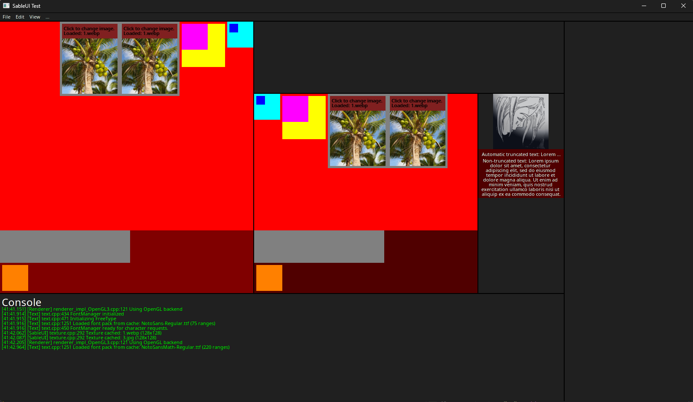
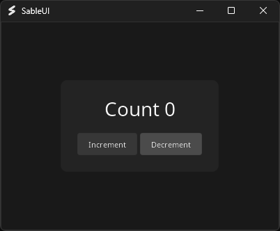

# SableUI
A high-performance C++ UI/application framework combining React's component
and state model, Tailwind's easy styling approach, and foobar2000's ColumnsUI
flexible panel-based layouts.


## Features
- **Declarative components** with reactive state management
- **Flexible layouts** with resizable splitter panels
- **Advanced text rendering** with full unicode support, custom styling, and colour
- **Cross-platform** compatibility supporting OpenGL (Vulkan support planned)
  - Supports Windows, Linux, and macOS, but untested until release (works on WSL)
- **Catppuccin-like** themeing that can be globally overriden

<br>
<details>
    <summary>More examples</summary>
    
</details>

### Example Usage: Counter App

```cpp
#include <SableUI/SableUI.h>

using namespace SableUI::Style; // for style properties

class Counter : public SableUI::BaseComponent {
public:
	void Layout() override {
		// Get the global theme (can be overriden)
		const SableUI::Theme& t = SableUI::GetTheme();
		
		// Outer container
		Div(bg(t.surface0), p(24), centerXY, rounded(10)) {
			// Text display
			Text(SableString::Format("Count %d", count.get()),
				fontSize(28), mb(20), justify_center);
			
			// Have buttons be laid out horizontally (from left -> right)
			Div(left_right) {
				// Increment button with primary colour
				Button("Increment", [this]() { 
					count.set(count.get() + 1); 
				}, bg(t.primary), fontSize(16), mr(4), size_lg);

				// Decrement button with secondary colour
				Button("Decrement", [this]() {
					count.set(count.get() - 1);
				}, bg(t.secondary), fontSize(16), size_lg);
			}
		}
	}

private:
	// State that updates the ui on change and preserves values across reconcilliation
	SableUI::State<int> count{ this, 0 };
};

int main() {
	// Register the component for use with strings (more flexible)
	SableUI::RegisterComponent<Counter>("Counter");

	SableUI::Initialise("SableUI", 400, 300);

	// Add component under main window
	Panel("Counter");

	// Main loop with WaitEvents() (most efficient)
	while (SableUI::WaitEvents())
		SableUI::Render();

	SableUI::Shutdown();
	return 0;
}
```
---

## Building and Using library
This project has a [documentation](sableui.oliwilliams.dev/getting-started) with a getting started guide to build the basic app seen above. Precompiled binaries are not released until v1.0 as things are subject to change.

## Acknowledgments
This project uses the following open-source libraries:
- [GLFW](https://github.com/glfw/glfw) - Window & input handling
- [GLAD](https://github.com/Dav1dde/glad) - OpenGL extensions
- [FreeType](https://www.freetype.org) - Font rendering
- [libwebp](https://github.com/webmproject/libwebp) - WebP image support
- [stb_image + stb_image_resize2](https://github.com/nothings/stb) - Image loading
- [Vulkan SDK](https://www.lunarg.com/vulkan-sdk/) - Vulkan graphics API
- [Shaderc](https://github.com/google/shaderc) - Cross-platform shader compilation

Licenses for these libraries can be found in their submodule directories as their source is linked to this library (vendor/)