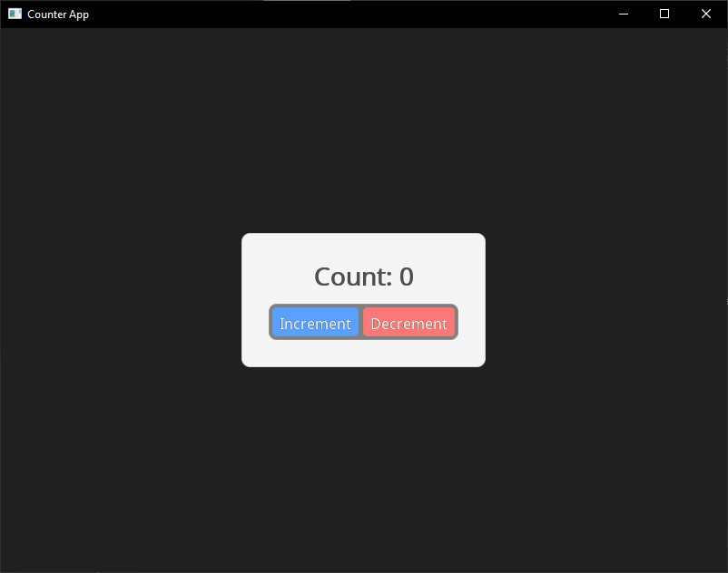

# Your First Application
Create `main.cpp`:
```cpp
#include <SableUI/SableUI.h>

class Counter : public SableUI::BaseComponent {
public:
    void Layout() override {
        Div(bg(245, 245, 245) p(30) centerXY w_fit h_fit rounded(10)) {
            Text(SableString::Format("Count: %d", count),
                fontSize(28) mb(20) textColour(20, 20, 20) justify_center);

            Div(left_right p(4) centerX rounded(9)) {
                Div(bg(90, 160, 255) p(8) mr(5) rounded(5)
                    onClick([this]() { setCount(count + 1); })) {
                    Text("Increment", 
                        textColour(255, 255, 255) fontSize(16) justify_center);
                }

                Div(bg(255, 120, 120) p(8) rounded(5)
                    onClick([this]() { setCount(count - 1); })) {
                    Text("Decrement",
                        textColour(255, 255, 255) fontSize(16) justify_center);
                }
            }
        }
    }

private:
    useState(count, setCount, int, 0);
};

int main(int argc, char** argv) {
    // Register your component
    SableUI::RegisterComponent<Counter>("Counter");

    // Initialize window
    SableUI::Window* window = SableUI::Initialise("Counter App", 800, 600);

    // Create layout
    Panel("Counter");

    // Main loop
    while (SableUI::PollEvents())
        SableUI::Render();

    SableUI::Shutdown();
    return 0;
}
```
### First build
**Windows:**
```bash
mkdir build
cd build
cmake ..
```
Open `MyApp.sln` in Visual Studio, set `MyApp` or your project as startup, and build. <br>
**OR** open `CMakeLists.txt` in Visual Studio and everything should configure by itself.

**Linux/macOS:**
```bash
mkdir build && cd build
cmake ..
make -j$(nproc)
```
Building and running your application you should now see the following on your screen:

Having Issues? Check [troubleshooting](troubleshooting-configuration.md)

---

## Understanding the Code
**1. Component Definition**
```cpp
class Counter : public SableUI::BaseComponent {
    void Layout() override { /* ... */ }
};
```
Components inherit from `BaseComponent` and override `Layout()` to describe their UI.

**2. State Management**
```cpp
useState(count, setCount, int, 0);
```
This declares a reactive state, calling `setCount()` modifies `count` and triggers a re-render.
> NOTE: This is simmilar to react's `useState`, synonymous with:
> ```js
> const [count, setCount] = useState<int>(0)
> ```
**3. Declarative UI**
```cpp
Div(bg(245, 245, 245) p(30)) {
    Text("Hello");
}
```
The use of macros (`div(...)`) and RAII ensure elements are properly opened and closed.

**4. Event Handling**
```cpp
onClick([this]() { setCount(count + 1); })
```
Lambda callbacks capture state and trigger updates.

**5. Registration & Initialisation**
```cpp
SableUI::RegisterComponent<Counter>("Counter");
SableUI::Window* window = SableUI::Initialise("App", 800, 600);
```
Register component types by name, then initiliase your first window.

**6. Panel Layout**
```cpp
Panel("Counter");
```
Attach registed components to panels, the scope for panel layout is created after window initialisation.

<br><br>

---

### Next Steps
By here, you now have a working SableUI application, you can either get a better understanding on the specifics of certain areas above, or go to the following pages. <br>
<br>
<div class="card-grid">
  <div class="card">
    
    <h2>Core concepts</h2>
    <p class="subtitle">Understand concepts such as components, states and more</p>
  </div>

  <div class="card">
    
    <h2>API reference</h2>
    <p class="subtitle">Learn how to build a anything using SableUI's layout system</p>
  </div>

  <div class="card">
    
    <h2>Examples</h2>
    <p class="subtitle">See real applications</p>
  </div>
</div>